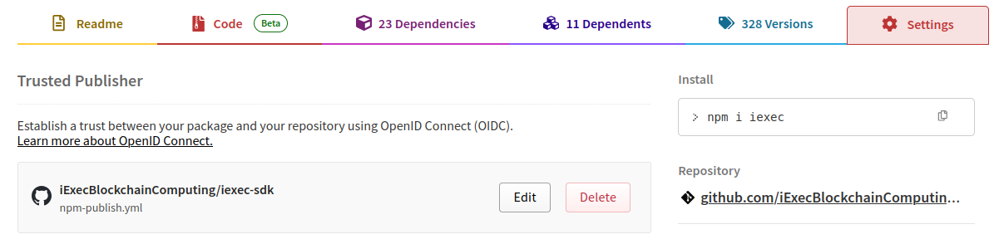

# NPM Package Publish - Reusable Workflow Documentation 🚀

## Overview 🌟

This reusable GitHub Actions workflow automates the process of publishing an NPM package. It is configurable via inputs
for the package scope, Node.js version, registry URL, and other options. The workflow performs the following actions:

- **Downloads Artifacts**: Downloads specified artifacts if needed. 📦
- **Checks Out Your Repository**: Retrieves your code. 📥
- **Sets Up Node.js**: Installs the specified Node.js version and configures the `.npmrc` file. ⚙️
- **Installs Dependencies**: Uses the specified install command (default: `npm ci`) to install the dependencies. 📦
- **Builds the Package**: Builds the package using the specified build command (default: `npm run build`). 🔨
- **Performs Type Checking**: Runs type checking if configured. 🔍
- **Checks Code Formatting**: Verifies code formatting if configured. 🧹
- **Runs Linting**: Performs code linting if configured. 🧹
- **Runs Tests**: Executes unit tests if enabled. ✅
- **Publishes the Package**: Publishes the package with provenance (if enabled) and the specified access level using
  `npm publish`. 🎉

## Workflow Inputs 🛠️

| **Input**                | **Description**                                               | **Required** | **Default**                         |
| ------------------------ | ------------------------------------------------------------- | ------------ | ----------------------------------- |
| **scope**                | NPM package scope (e.g., `@iexec`).                           | No           | `@iexec`                            |
| **node-version**         | Node.js version to use.                                       | No           | `20`                                |
| **registry**             | NPM registry URL.                                             | No           | `https://registry.npmjs.org`        |
| **access**               | Package access (public or restricted).                        | No           | `public`                            |
| **provenance**           | Enable npm provenance.                                        | No           | `true`                              |
| **install-command**      | Install dependencies command.                                 | No           | `npm ci`                            |
| **build-command**        | Build package command.                                        | No           | `npm run build`                     |
| **run-tests**            | Execute unit tests step.                                      | No           | `false`                             |
| **test-command**         | Run unit tests command.                                       | No           | `npm test --if-present`             |
| **lint-command**         | Run linting command.                                          | No           | `npm run lint --if-present`         |
| **type-check-command**   | Run type-checking command.                                    | No           | `npm run check-types --if-present`  |
| **format-check-command** | Run format-checking command.                                  | No           | `npm run check-format --if-present` |
| **environment**          | GitHub environment.                                           | No           | `production`                        |
| **tag**                  | npm publish tag (e.g., latest, nightly).                      | No           | `''` (empty string)                 |
| **working-directory**    | Directory containing package.json.                            | No           | `''` (empty string)                 |
| **artifact-name**        | Name of an artifact to download before the build.             | No           | `''` (empty string)                 |
| **artifact-path**        | Destination path for the downloaded artifact.                 | No           | `''` (empty string)                 |
| **version**              | Version to publish (leave empty to use package.json version). | No           | `''` (empty string)                 |
| **dry-run**              | Run in dry-run mode (the package will not be published).      | No           | `false`                             |

### Secrets 🔐

| **Secret**    | **Description**                                                                                | **Required** |
| ------------- | ---------------------------------------------------------------------------------------------- | ------------ |
| **npm-token** | NPM auth token (required unless `dry-run: true` or workflow is called by a trusted publisher). | No           |

## Job and Steps ⚙️

### Job Name: `build`

- **Runs On**: `ubuntu-latest`.
- **Environment**: Uses the environment specified in `inputs.environment`.
- **Permissions**:
  - `contents: read` – to access repository contents. 🔍
  - `packages: write` – to allow package publication. ✨
  - `id-token: write` – for authentication purposes. 🔑

## How to Use This Reusable Workflow 🔄

### With trusted publishers (no token needed)

1. **Call the Reusable Workflow**

   In another workflow file (e.g., triggered by a release), invoke this reusable workflow like so:

   ```yaml
   name: Call Publish Package NPM Workflow
   on:
     release:
       types: [published]

   permissions:
     id-token: write # Required for OIDC
     packages: write
     contents: read

   jobs:
     publish:
       uses: iExecBlockchainComputing/github-actions-workflows/.github/workflows/publish-npm.yml@main
       with:
         node-version: "22"
         build-command: "npm run build:prod"
         run-tests: true
         test-command: "npm run test:ci"
         lint-command: "npm run lint"
         type-check-command: "npm run check-types"
         format-check-command: "npm run check-format"
         # Optional: Download an artifact before building
         # artifact-name: 'my-build-artifact'
         # artifact-path: './dist'
   ```

2. **Configure Trusted Publisher on NPM**

   On [npmjs.com](https://www.npmjs.com/), configure your the root publish workflow of your GitHub repository as a trusted publisher for your package.
   

   NB: You can have only one trusted publisher per package, if you need multiple publication triggers (workflow_dispatch, release, etc.), you need to merge them into a single workflow referenced as trusted publisher.

### With npm token (deprecated)

1. **Call the Reusable Workflow**

   In another workflow file (e.g., triggered by a release), invoke this reusable workflow like so:

   ```yaml
   name: Call Publish Package NPM Workflow
   on:
     release:
       types: [published]

   jobs:
     publish:
       uses: iExecBlockchainComputing/github-actions-workflows/.github/workflows/publish-npm.yml@main
       with:
         node-version: "22"
         build-command: "npm run build:prod"
         run-tests: true
         test-command: "npm run test:ci"
         lint-command: "npm run lint"
         type-check-command: "npm run check-types"
         format-check-command: "npm run check-format"
         # Optional: Download an artifact before building
         # artifact-name: 'my-build-artifact'
         # artifact-path: './dist'
       secrets:
         npm-token: ${{ secrets.NPM_TOKEN }}
   ```

2. **Configure Secrets**

   Ensure that the `NPM_TOKEN` secret is added to your repository’s settings. This token is required to authenticate
   with the NPM registry during publishing. 🔑

## Workflow Steps in Detail 🔍

1. **Download Artifacts**: If `artifact-name` is provided, downloads the specified artifact using `actions/download-artifact@v4` to the path specified by `artifact-path`.
2. **Checkout Repository**: Uses `actions/checkout@v4` to fetch your code.
3. **Setup Node.js**: Configures Node.js with `actions/setup-node@v4`, including registry URL and scope configuration.
4. **Install Dependencies**: Runs the specified install command (default: `npm ci`).
5. **Build Package**: Builds the package using the specified build command (default: `npm run build`).
6. **Run Type Checks**: Performs type checking using the specified command (default: `npm run check-types --if-present`).
7. **Check Code Format**: Verifies code formatting using the specified command (default: `npm run check-format --if-present`).
8. **Run Linting**: Performs code linting using the specified command (default: `npm run lint --if-present`).
9. **Run Unit Tests**: If `run-tests` is set to `true`, executes tests using the specified test command (default: `npm test --if-present`).
10. **Publish Package**: Publishes the package to the NPM registry with the specified configuration, including optional tag and provenance settings.
